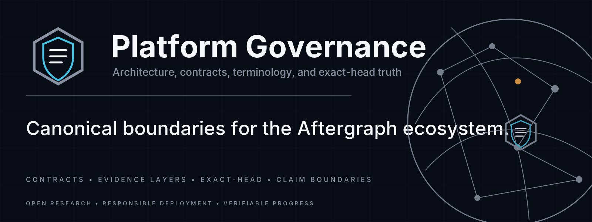
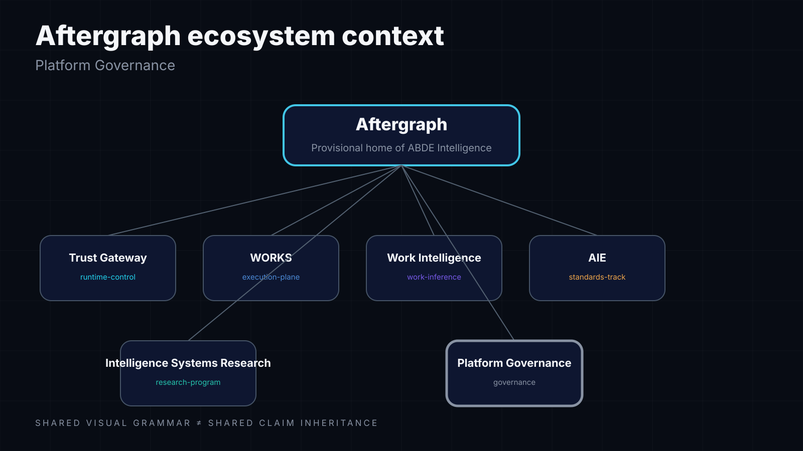
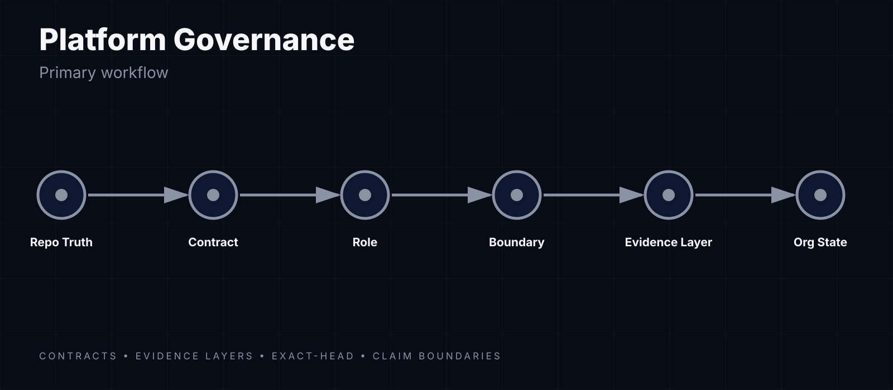

<!-- aftergraph-brand-os:v1.0.0 -->

[](https://scorecard.dev/viewer/?uri=github.com/Aftergraph/after-graph-governance)

<p align="center">
  <picture>
    <source media="(prefers-color-scheme: dark)" srcset=".github/assets/github/hero.webp">
    
  </picture>
</p>

# Aftergraph Platform Governance

> Canonical cross-repository topology, contracts, boundaries and exact-head truth mechanics for the Aftergraph ecosystem.

**Brand status:** Aftergraph / ABDE Intelligence naming remains provisional and has not completed trademark clearance. Repository/contract boundaries are technical governance and do not depend on final brand naming.

## Platform model

Aftergraph is a polyrepo platform. Repositories remain independently versioned and independently accountable for their runtime, conformance and scientific claims.

```text
Public / Knowledge
  aftergraph.org · docs · .github · brand
          ↓
Experience
  studio · wi-frontend · autonomous-venture-company (legacy transition)
          ↓
Intent / Work / Continuity
  wi-backend · context-continuity
          ↓
Institution / Enforcement / Runtime / Execution
  AIE → Trust Gateway → Runtime → WORKS
          ↓
Capabilities / Models
  skills-vault · llm-research-development · afm · model-registry
          ↓
Assurance / Verification
  intelligence-systems-research · continuum · sentinel
          ↓
Verified outcomes

Cross-cutting operations observation:
  aftergraph-cron-fabric

Explicit special states:
  sentinel-firetest · sentinel-firetest2 = temporary verification fixtures
  veranza = private incubation / INTERNAL HOLD
```

Cross-cutting governance lives here. The topology contract contains **25 repositories** at the 2026-09-10 reconciliation cut (24 canonical + temporary `sentinel-firetest2`, expires 2026-09-22). Topology membership never upgrades maturity, evidence, conformance or authority.

## Canonical topology

`docs/platform-topology/2.0.json` is the slow-changing machine-readable topology contract: repository name, role, architecture plane, system class, canonical branch and visibility. It contains **no exact Git SHAs**. (`docs/platform-topology/1.0.json` is retained for historical provenance.)

`latest-org-state.json` is the fast-changing generated GitHub truth snapshot: exact remote HEAD, branch, protection, open PRs and contract annotations.

```text
platform-topology/2.0 = slow-changing repository/ownership truth
org-state/1.0         = fast-changing exact-head GitHub truth
```

```text
platform-topology/2.0
        ↓ defines scope + roles
scripts/org-state-verify.sh
        ↓ queries GitHub remote truth
org-state/1.0 / latest-org-state.json
```

This separation prevents repository scope from being hard-coded into the generator while preserving the rule that exact Git state is never hand-authored.

## Core ownership boundaries

The table below is a generated projection of `docs/platform-topology/2.0.json` — do not edit it by hand. Regenerate with `python scripts/platform_topology.py write-readme`; CI verifies it with `check-readme`.

<!-- platform-topology-v2:start -->
| Architecture plane | System class | Repository | Role | Lifecycle | Canonical responsibility |
|---|---|---|---|---|---|
| Intelligence | work-intelligence | `wi-backend` | work-inference | active | Source-neutral observation to canonical WorkItem inference, review, publication and promotion boundaries. |
| Authority | institution | `aie` | normative-authority | active | Portable institution, authority, delegation, lifecycle, budget and revocation semantics. |
| Trust | enforcement | `trust-gateway` | runtime-enforcement | active | Fail-closed runtime admission, policy enforcement, approvals, secrets and action audit. |
| Runtime | runtime | `runtime` | agent-runtime | active | Agent lifecycle, orchestration, dispatch, checkpoints, metering and observability. |
| Execution | execution | `works-execution` | durable-execution | active | Durable work state, scheduling, workers, leases, recovery, execution evidence and quittance. |
| Verification | assurance | `sentinel` | verified-code-review | active | Exact-HEAD verified code-review verdicts with stale-base invalidation and cited evidence. |
| Experience | experience | `studio` | primary-experience | active | General-purpose human operating environment for Chat, Work, Space, control and evidence surfaces. |
| Experience | specialist-experience | `wi-frontend` | work-intelligence-experience | active | Wie browser experience and least-privilege BFF consuming canonical Work Intelligence state from wi-backend. |
| Support | foundation | `.github` | organization-community | active | Organization profile, contribution defaults, security/support routing and shared community infrastructure. |
| Support | models | `afm` | model-program | active | AFM-specific model training, datasets, experiments, evaluations and artifact manifests. |
| Support | governance | `after-graph-governance` | canonical-contracts | active | Platform topology, cross-repo boundaries, contract registration and generated org-state mechanics. |
| Support | operations | `aftergraph-cron-fabric` | scheduled-observation-fabric | active | Read-only scheduled organization sensing, evidence gating, dedupe and Telegram escalation. It grants no execution authority. |
| Support | public | `aftergraph.org` | public-front-door | active | Public website, marketing information architecture and system launcher. |
| Support | legacy-transition | `autonomous-venture-company` | legacy-migration-source | legacy-transition | Legacy product, Hermes integration and migration-source behavior pending governed extraction. |
| Support | foundation | `brand` | brand-design-system | active | Visual identity, semantic design tokens, master assets and public communication design rules. |
| Support | continuity | `context-continuity` | continuity-contract | active | Portable transfer of actionable context/state across model, agent, session and runtime boundaries. |
| Support | assurance | `continuum` | continuity-containment-verification | active | Continuity and containment fault-injection campaigns and verification harnesses. |
| Support | knowledge | `docs` | knowledge-plane | active | Provenance-pinned rendering, discovery, developer documentation and agent-readable context surfaces. |
| Support | research-assurance | `intelligence-systems-research` | research-assurance | active | SPEC-001, MISSION-Bench methodology, scientific claims, experiments, assurance and publication evidence. |
| Support | models | `llm-research-development` | model-rnd-methodology | active | Reusable model research, experiment, evaluation, promotion and provenance methodology. |
| Support | models | `model-registry` | model-lifecycle-registry | active | Immutable promoted model identities, versions, aliases, lifecycle, provenance and artifact locations. |
| Support | assurance-fixture | `sentinel-firetest` | temporary-verification-fixture | temporary | Throwaway live-fire fixture for Sentinel proofs. Topology membership is temporary and grants no permanent platform responsibility. |
| Support | assurance-fixture | `sentinel-firetest2` | temporary-verification-fixture | temporary | Throwaway live-fire fixture for Sentinel proofs (second instance, live-verified 2026-09-10). Topology membership is temporary and grants no permanent platform responsibility. |
| Support | capabilities | `skills-vault` | capability-supply-chain | active | Governed skill discovery, trust, lifecycle, provenance, compatibility and distribution. |
| Support | incubation | `veranza` | assurance-incubation | internal-hold | Internal assurance-product incubation concept under naming/clearance hold. Topology membership does not imply public or production maturity. |
<!-- platform-topology-v2:end -->

## Governance

> **Everything extensible is a plugin. Everything consequential is governed.**

For consequential execution the governing composition remains:

```text
Executable = Intersection(AIE authority/policy, Trust Gateway runtime admission, WORKS durable execution)
```

Runtime orchestrates agent operation inside that architecture but does not widen AIE authority, bypass Trust Gateway admission, replace WORKS durable execution or self-issue an independent verification verdict.

No UI, model, skill, plugin, research result, repo membership or textual agent declaration grants execution authority by itself.

## Cross-repo contracts

The normative register is maintained in [`docs/cross-repo-contracts.md`](docs/cross-repo-contracts.md).

Current registered families include:

`cpi/1.0`, `rab/1.0`, `identity/1.0`, `policy.token/1.0`, `secret.ref/1.0`, `shell.contracts/1.0`, `link.wire/1.0`, `pairing/1.0`, `brain.ns/1.0`, `release.rings/1.0`, `evidence.schema/1.1`, `kernel.budget/1.0`, `kernel.lifecycle/1.0`, `mission-state/1.0`, `org-state/1.0`.

A repository may participate in the platform without owning a normative contract. Topology membership and normative ownership are separate concepts.

## Org State Contract — exact-head truth

The **Org State Contract** (`docs/contracts/org-state/1.0.json`) is the machine-verifiable remote-state surface for the whole topology-defined organization.

```bash
bash scripts/org-state-verify.sh
bash scripts/org-state-verify.sh --check-local <path...>
```

The generator:

- loads repository scope and roles from `docs/platform-topology/2.0.json`;
- rejects duplicate topology entries;
- rejects canonical-branch drift;
- queries exact remote HEADs from GitHub;
- refuses a partial snapshot if any topology repository cannot be resolved;
- validates against `org-state/1.0`;
- can additionally detect local checkout divergence.

Consumers (Hermes/Codex/AVC agents, CI, reviewers) MUST verify exact heads against a fresh generated contract before gap analysis, delegation or merge decisions. A SHA in a handoff, roadmap or briefing is a claim; a fresh generated org-state is remote truth.

## Evidence layers

| Layer | Producer | Format |
|---|---|---|
| L1 Action Audit | Trust Gateway | hash-chain/action audit |
| L2 Execution Quittance | WORKS | content-addressed execution/evidence bundle |
| L3 Institutional Conformance | AIE | conformance vectors + policy/authority evidence |
| L4 Scientific Evidence | ISR | preregistered studies / MISSION-Bench / statistical analysis |

No layer automatically upgrades another:

- runtime evidence does not establish AIE conformance;
- AIE conformance does not establish scientific validity;
- scientific results do not grant runtime authority;
- public visibility does not upgrade maturity;
- exact-head state does not prove functional conformance.

## Platform Reconciliation V1

The current platform-wide reconciliation program and actionable backlog live in:

- [`docs/PLATFORM-RECONCILIATION-V1.md`](docs/PLATFORM-RECONCILIATION-V1.md) — execution ledger / P0–P2 tasks
- [`docs/platform-topology/2.0.json`](docs/platform-topology/2.0.json) — complete machine-readable repository topology
- [`dependencies.yml`](dependencies.yml) — platform dependency/ownership graph
- [`docs/cross-repo-contracts.md`](docs/cross-repo-contracts.md) — normative contract register + repository boundaries
- [`docs/reconciliation-matrix.md`](docs/reconciliation-matrix.md) — concept-level reconciliation
- [`docs/REPOSITORY-REGISTRY-v0.1.md`](docs/REPOSITORY-REGISTRY-v0.1.md) — canonical repository roles, local worktree controls, reconciliation queue
- [`docs/PLATFORM-ARCHITECTURE-V4.md`](docs/PLATFORM-ARCHITECTURE-V4.md) — canonical architecture: seven planes, Fabrics, ownership, invariants, conformance ladder
- [`docs/PLATFORM-ARCHITECTURE-V3.md`](docs/PLATFORM-ARCHITECTURE-V3.md) — superseded history (retained for provenance)
- [`docs/AVC-IDENTITY-MAPPING-V1.md`](docs/AVC-IDENTITY-MAPPING-V1.md) — Wave 5 finding: AVC identity-core vs TG/AIE verdicts per entity
- [`docs/AVC-TENANT-MAPPING-V1.md`](docs/AVC-TENANT-MAPPING-V1.md) — Wave 5 finding: tenant-admin vs runtime-isolation layers, lifecycle gap

## Other key artifacts

- [`docs/ABDE-BRAND-ARCHITECTURE-v0.2.md`](docs/ABDE-BRAND-ARCHITECTURE-v0.2.md) — provisional brand architecture
- [`docs/NAMING-STANDARD-v0.1.md`](docs/NAMING-STANDARD-v0.1.md) — naming rules
- [`docs/evidence-layer-model.md`](docs/evidence-layer-model.md) — evidence separation model
- [`docs/PLATFORM-BOUNDARY-CHARTER-v0.1.md`](docs/PLATFORM-BOUNDARY-CHARTER-v0.1.md) — original platform boundary charter
- [`docs/ACC-BOUNDARY-PROPOSAL-v0.1.md`](docs/ACC-BOUNDARY-PROPOSAL-v0.1.md) — continuity boundary proposal/history

## System visuals

<p align="center">
  
</p>

<p align="center">
  
</p>

<p align="center">
  
</p>

## License

Apache-2.0

---

**Brand status:** Aftergraph / ABDE Intelligence are PROVISIONAL — NOT TRADEMARK CLEARED. No irreversible naming migration should be inferred from this technical reconciliation.
